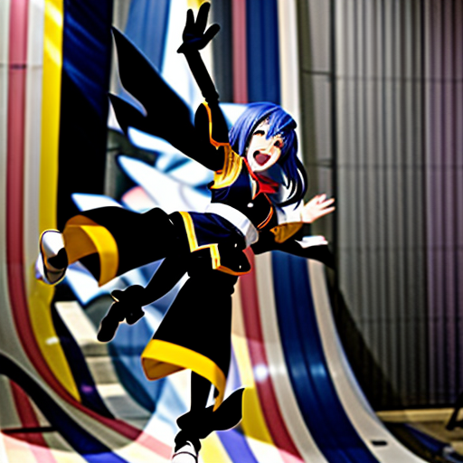
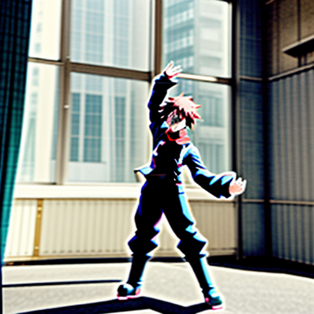

# Reference-Image Conditioning: What's Broken, What to Watch For, What to Use Instead

This documents, with actual test images rather than just error text, why
reference-image conditioning doesn't work on this project today, and which
of the currently-accessible Workers AI text-to-image models are worth using
going forward. Everything below was tested live against this account, not
inferred from Cloudflare's documentation — see
[04-lessons-learned.md](04-lessons-learned.md) for why that distinction
matters here specifically.

## The reference image used for every test below


`characters/bob-002.jpg` — bald, glasses, white beard, black hoodie, jeans,
empty background. Every test in this document asks a model to generate a
variation of this same character ("waving both arms, excited") while passing
this image in as a reference, and compares that against the same prompt
and seed with no reference image at all.

## What's actually broken

### 1. `stable-diffusion-xl-base-1.0` — documented to accept an image, doesn't

Cloudflare's docs list `image` (byte array) and `image_b64` (base64 string)
as supported img2img inputs. Both fail outright:

```
502: AI generation failed: 3030: Model input is not valid: input tensor
`image` is not present in the model
```

This is a confirmed Cloudflare docs/platform gap
([cloudflare/cloudflare-docs#11835](https://github.com/cloudflare/cloudflare-docs/issues/11835)),
not a mistake in how this project called it — community reports show the
identical error.

### 2. `stable-diffusion-v1-5-img2img` — the dedicated model, account-gated

This is the model Cloudflare's own catalog names as the img2img specialist.
It returns:

```
502: AI generation failed: 5018: This account is not allowed to access
@cf/runwayml/stable-diffusion-v1-5-img2img
```

Not a code problem — an account/plan permission this Cloudflare account
doesn't currently have.

### 3. `stable-diffusion-xl-lightning` and `dreamshaper-8-lcm` — accessible, and *silently* don't condition on the image

These two are worth walking through in detail, because unlike the two above
they return `200` with a real image — the failure here is quiet, not loud,
which makes it the most dangerous kind.

**`stable-diffusion-xl-lightning`**: sending the same prompt and seed, once
with `image_b64` set to the reference image and once without it, produced
**byte-for-byte identical output** (same SHA1 checksum). The field is
accepted, costs nothing to include, and does precisely nothing.

**`dreamshaper-8-lcm`**: same test produced *different* output with vs.
without the reference image — encouraging, until you look at what it
actually generated:

| With `image_b64` = reference | Without any reference image |
|---|---|
|  |  |

Neither output has a bald head, a beard, glasses, or a black hoodie — neither
resembles the reference image at all. The two are simply two different
random samples; the only reason the bytes differed from the sdxl-lightning
test is that supplying `image_b64` also implicitly sends a `strength`
parameter, which nudges the sampling schedule even though the image itself
is never actually used. **A different output is not proof of conditioning.**
This is the single most important thing to watch for when re-testing any of
this in the future: always compare against a same-seed, no-reference control,
and actually look at the pixels, not just the status code or the checksum.

## What to watch for, going forward

- **Cloudflare fixing [#11835](https://github.com/cloudflare/cloudflare-docs/issues/11835).**
  If `stable-diffusion-xl-base-1.0` ever actually implements `image`/
  `image_b64`, re-run the exact same-seed comparison test above before
  trusting it — a `200` response alone was already shown to be
  insufficient evidence twice in this investigation.
- **This account being granted access to `stable-diffusion-v1-5-img2img`.**
  Test with the same comparison method the moment access changes — a `5018`
  error becoming a `200` is not the same as confirming real conditioning
  either.
- **`flux-2-dev`'s "multi-reference support" — the most promising lead, not yet usable.**
  See below: it needs a different request shape this project doesn't send yet.
- **New models appearing in the [Workers AI Text-to-Image catalog](https://developers.cloudflare.com/workers-ai/models/?tasks=Text-to-Image).**
  It listed 11 models as of this writing; re-check it periodically, since this
  is an actively growing catalog (three FLUX.2 models and two Leonardo
  models all appeared on this list without needing any code change here to
  discover them).
- **Never trust a documented schema field until it's been exercised live
  with a same-seed, with/without comparison** — the recurring, hard-learned
  rule of this entire investigation.

## `flux-2-dev`: the real path forward, blocked on a request-shape gap (not access)

`flux-2-dev` (`@cf/black-forest-labs/flux-2-dev`) is the only model in the
current catalog that explicitly advertises **"multi-reference support"** —
exactly what this project originally set out to build, and potentially
better (multiple references, not just one). Testing it with the same simple
JSON body this project's Worker already sends to every other model failed
differently from everything else:

```
502: AI generation failed: 5006: Error: required properties at '/' are 'multipart'
```

This isn't an access restriction (no `5018`) and isn't a broken-docs
situation (no tensor error) — its raw input schema really is
`{"multipart": {"body": ..., "contentType": ...}}`, meaning this model
expects an actual `multipart/form-data` request, not the flat JSON object
`{ prompt, width, height, images }` that works for every SDXL-family model.
`flux-2-klein-9b` and `flux-2-klein-4b` (same family, image *editing* rather
than pure generation) hit the identical error. Making these work means
teaching `src/worker.js` to construct a real multipart body for this one
model family — a genuine implementation task, not a blocked wait for
Cloudflare or for account access. This is the strongest candidate for
Stage 3 if reference-image conditioning is still wanted.

## Model recommendations, given what's accessible right now

All of the below were tested live against this account (not assumed from
docs). None of them do reference-image conditioning today — that capability
depends on the `flux-2-dev` multipart work or one of the two external
unblocks above.

| Model | Access | Size handling | Recommendation |
|---|---|---|---|
| `@cf/black-forest-labs/flux-1-schnell` | ✅ (current default) | Fixed 1024x1024, ignores width/height | Keep as the fast default for `character-generator` and anywhere exact size doesn't matter. |
| `@cf/stabilityai/stable-diffusion-xl-base-1.0` | ✅ (current `--type=png`) | Honors width/height, 256–2048px, must be a multiple of 8 (undocumented, confirmed live) | Keep as the sized-output default. No image input despite docs. |
| `@cf/leonardo/lucid-origin` | ✅ | Honors width/height; auto-clamps out-of-range values instead of erroring (tested: a requested 2480x2480 quietly came back 2048x2048, no 502) | **Worth adopting.** Friendlier failure mode than sdxl for oversized requests — worth it alone. No image input. |
| `@cf/leonardo/phoenix-1.0` | ✅ | Similar range to sdxl (untested at the edges) | Marketed for strong prompt adherence and legible in-image text — worth testing if a slide ever needs generated text baked into the image itself. |
| `@cf/bytedance/stable-diffusion-xl-lightning` | ✅ | Same 256–2048 style range as sdxl-base | A faster sdxl alternative if generation latency matters; confirmed its `image`/`image_b64` fields do nothing, so don't reach for it expecting img2img. |
| `@cf/lykon/dreamshaper-8-lcm` | ✅ | Defaults to 512x512 if no size given; honors width/height when supplied | Lower default resolution than the others; confirmed its img2img fields don't condition either. Lower priority than the above. |
| `@cf/runwayml/stable-diffusion-v1-5-inpainting` | ✅ (notably, *not* account-gated like its img2img sibling) | Requires a separate `mask_image` input, untested further | Different use case (masked editing of an existing image, not reference-based generation) — a possible Stage 3+ avenue for editing a generated scene, not for character consistency. |
| `@cf/runwayml/stable-diffusion-v1-5-img2img` | ❌ `5018` account-gated | — | Re-test if access is ever granted. |
| `@cf/black-forest-labs/flux-2-dev` | ⚠️ Accessible, but wrong request shape (`multipart` required) | Unknown — schema not published beyond the multipart wrapper | **Top candidate for actual reference-image support** — needs Worker-side multipart implementation, not a blocked external dependency. |
| `@cf/black-forest-labs/flux-2-klein-9b` / `flux-2-klein-4b` | ⚠️ Same multipart gap | Unknown | Image *editing* models (unify generation + editing) — same integration work as flux-2-dev would unlock these too. |
